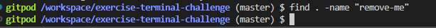

* 1 Print current directory path

    

* 2 List all the files from the current directory including the hidden ones

    

* 3 Now list all the files inside the workspace, recursively (all files in the hierarchy)

    

* 4 Go to the last level below the small-name folder and write in the console the content of the trophy.txt file

    

* 5 Move back to the root and List all files with the JavaScript typical extension

    
    
* 6 create a new folder inside `funcode/the-most-funny/` called "not-that-funny"

    

* 7 Create a copy of the last file you can find below the /boringfolder/ childs (the-mostboring-text.txt)

    

* 8 remove the "remove-me" folder from the funcode directory

    
    

* 9 print in the screen the-ultimate-joke.txt

    

* 10 remove all the contents from the boringfolder, they are extremely boring

    
