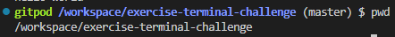
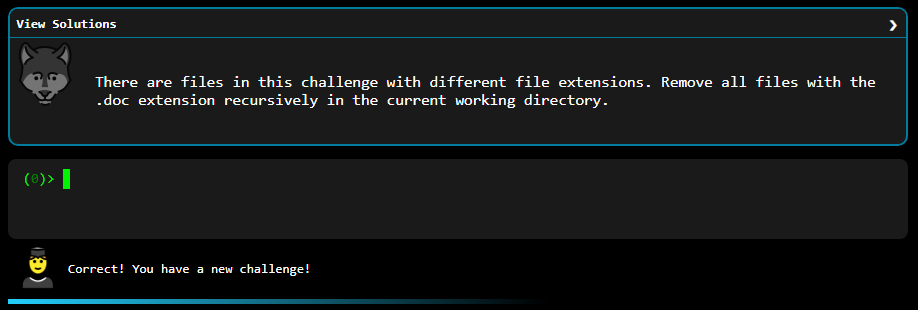

# SOLUCION

## 1 Desafío:
echo 'hello world'

## 2 Desafío:   
pwd

## 3 Desafío:
ls

## 4 Desafío:
cat assetss.txt

## 5 Desafío:
tail -5 assetss.txt

## 6 Desafío:
touch take-the-command-challenge 

## 7 Desafío:.
mkdir tmp tmp/files 

## 8 Desafío:
cp take-the-command-challenge tmp/files

## 9 Desafío:
mv take-the-command-challenge tmp/files

## 10 Desafío:
ln -s tmp/files/take-the-command-challenge take-the-command-challenge 

## 11 Desafío:
m -rf * .*

## 12 Desafío:
find -name "*.doc" -delete

## 13 Desafío:
grep GET access.log

## 14 Desafío:
grep -l 500 *

## 15 Desafío:
find -name "access.log*"

## 16 Desafío:
grep -rh 500

## 17 Desafío:
grep -ro ^[0-9.]*

## 18 Desafío:
ls -l | wc -l

## 19 Desafío:
cat access.log | sort

## 20 Desafío:
grep GET access.log | wc -l

## 21 Desafío:
cat split-me.txt | tr ';' '\n'

## 22 Desafío:
echo {1..100}

## 23 Desafío: